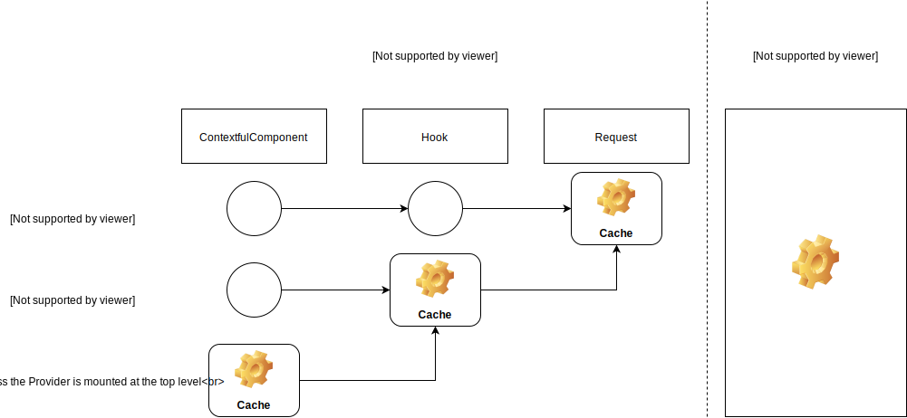

class: middle, center

# Hooks and Context, the way to a new architecture

---

class: middle, center

## What we will cover during this presentation

- The Context API
- The new Hooks API
- Some clues for more modern and more flexible architecture
- The edge cases

---

class: middle, center

## The Context API

---

class: middle, center

## The Hooks API

---

class: middle

> Hooks are a new feature proposal that lets you use state and other React features without writing a class. They’re currently in **React v16.7.0-alpha**

---

### What does Hook solve?

React Component is great to organize large UI into small, independent, and reusuable piece.

However, it is quite challenging to break down complex components, since the logic is **stateful** and can't be extracted to a function or another component.

---

### Complex components, with logic all over the lifecyle

```typescript
class App extends React.Component {
  constructor(props) {
    super(props);
    this.state = { name: "Kawamura", like: "curry" };
  }
  componentDidMount() {
    fetchA();
    fetchB();
    subscribe();
  }
  componentWillUpdate(props) {
    if (props.a !== this.props.a) fetchA();
    if (props.b !== this.props.b) fetchB();
  }
  componentWillUnmount() { unSubscribe(); }
  handleNameChange(event) { this.setState({ name: event.target.value }); }
  render() { ... }
}
```

Each _lifecycle methods_ is consisted with **unrelated logics**, and the related code that changes together gets **split apart**.

Very difficult to maintain 😇

---

### Some Solutions.

- Context
- Render props
- Higher Order Components

These patterns requires you to restructure your components.  
Which can be **tedious**, make code harder to follow, and also creates **false hierarchy**.

```typescript
<ProviderA>
  <ProviderB>
    <SomeRenderProps>{({ data }) => <div>{data}</div>}</SomeRenderProps>
  </ProviderB>
  <RenderProps>{({ data }) => <div>{data}</div>}</SomeRenderProps>
</ProviderA>
```

Wouldn't it be easier to have **one** common way to share logic between components?  
... functions?

Functions _can't have local state_.

---

### Reusing stateful logic between Components.

**Hooks** are greak solution for solving these problems.

Hooks let us use React features from a function.  
It can process throught `state`, `context`, and `lifecycle`.

We can extract and share the logic inside a component into reusable independent function without changing your component hireachy.

---

### Example - Without Hooks

```typescript
class App extends React.Component {
  constructor(props) {
    super(props);
    this.state = { name: "Kawamura", favoriteFood: "curry" };
    this.handleNameChange = this.handleNameChange.bind(this);
    this.handleFavoriteFoodChange = this.handleFavoriteFoodChange.bind(this);
  }
  handleNameChange(event) {
    this.setState({ name: event.target.value });
  }
  handleFavoriteFoodChange(event) {
    this.setState({ favoriteFood: event.target.value });
  }
  render() {
    const { name, favoriteFood } = this.state;
    return (
      <>
        <input value={name} onChange={handleNameChange} />
        <input value={favoriteFood} onChange={handleFavoriteFood} />
      </>
    );
  }
}
```

---

### Example - With Hooks - useState

```typescript
import React, { useState } from "react";

const App = () => {
  const [name, handleName] = useState("Kawamura");
  const [favoriteFood, handleFoodName] = useState("curry");
  return (
    <>
      <input value={name} onChange={handleNameChange} />
      <input value={favoriteFood} onChange={handleFavoriteFood} />
    </>
  );
};
```

---

### Hooks - useState

---

### Example - useEffects

---

### Example - useContexts

---

### Example - useReducers

---

### For more information

<!--  -->

_https://youtu.be/dpw9EHDh2bM_

---

class: middle, center

## A new Architecture

---

class: middle, center

### Some rules

- Try to split as much as possible the logic and the view by using `hooks`
- Doing so is not _mandatory_ but it will make our code easier to reuse
- It may become necessary to "wrap" a `hook` with a `ContextfulComponent`

---

### Example (without hooks)

Let's say we want to fetch some posts from a server with this API: https://jsonplaceholder.typicode.com/posts.

Using the Context API, we can natively implement this kind of solution:

#### Types

```typescript
import React, { Reducer, useEffect, useReducer } from "react";

// Define some types related to the posts

interface State {
  isFetchingPosts: boolean;
  posts: Post[] | null;
}

type Actions =
  | { type: "FETCH_POSTS_INIT" }
  | { type: "FETCH_POSTS_FAILURE"; payload: Error }
  | { type: "FETCH_POSTS_SUCCESS"; payload: Post[] };
```

---

#### Logic - reducer

```typescript
const reducer: Reducer<State, Actions> = (state, action) => {
  switch (action.type) {
    case "FETCH_POSTS_INIT": {
      return { ...state, isFetchingPosts: true };
    }

    case "FETCH_POSTS_FAILURE": {
      return { ...state, isFetchingPosts: false };
    }

    case "FETCH_POSTS_SUCCESS": {
      return { ...state, isFetchingPosts: false, posts: action.payload };
    }
  }
};
```

---

#### Logic - Component

```typescript
const Component = (/* some props */) => {
  const [state, dispatch] = useReducer(reducer, { isFetchingPosts: false, posts: [] });

  const fetchPosts = async () => {
    dispatch({ type: 'FETCH_POSTS_INIT' });
    // Actually fetch data, building a `response` value
    if (!response.ok) {
      return dispatch({ type: 'FETCH_POSTS_FAILURE', payload: new Error('...') });
    }

    return dispatch({ type: 'FETCH_POSTS_SUCCESS', payload: await response.json() });
  };

  useEffect(() => {
    fetchPosts();
  }, []);

  return (
    // UI
  );
};
```

---

class: middle, center

## What if I want to fetch an other resource?

---

class: middle, center

### I will need to copy paste most of the logic...

---

class: middle, center

### Let's try to split the View and the Hook

---

### Example (with hook)

We will now try to implement the same logic using Hooks

In `/src/hooks/useFetch.ts`:

#### Types (everything is now dynamic)

```typescript
import { Reducer, useEffect, useReducer } from "react";

interface State<T> {
  data: T | null;
  isFetching: boolean;
}

type Actions<T> =
  | { type: "FETCH_INIT" }
  | { type: "FETCH_FAILURE"; payload: Error }
  | { type: "FETCH_SUCCESS"; payload: T };
```

---

#### Logic - reducer

```typescript
const reducer: Reducer<State<any>, Actions<any>> = (state, action) => {
  switch (action.type) {
    case "FETCH_INIT": {
      return { ...state, isFetching: true };
    }

    case "FETCH_FAILURE": {
      return { ...state, isFetching: false };
    }

    case "FETCH_SUCCESS": {
      return { ...state, isFetching: false, data: action.payload };
    }
  }
};
```

---

### Logic - Hook body

```typescript
// The return type has to be explicitly a Tuple
export type UseFetchReturnType<T> = [State<T>, Dispatch<Actions<T>>];

export function useFetch<T>(url: string): UseFetchReturnType<T> {
  const [state, dispatch] = useReducer<State<T>, Actions<T>>(reducer, {
    isFetching: false,
    data: null
  });

  const fetchData = async () => {
    dispatch({ type: "FETCH_INIT" });
    // Fetch data...
    if (!response.ok) {
      return dispatch({ type: "FETCH_FAILURE", payload: new Error("...") });
    }
    return dispatch({ type: "FETCH_SUCCESS", payload: await response.json() });
  };

  useEffect(() => {
    fetchData();
  }, []);

  // We can also only return the state, to avoid the user to accidentaly change the state
  return [state, dispatch];
}
```

---

#### Logic - Component

In `src/components/Posts.tsx`:

```typescript
// Some types related to Post

const Component = (/* some props */) => {
  const [state, dispatch] = useFetch<Post[]>(
    "https://jsonplaceholder.typicode.com/posts"
  );

  return; // UI
};
```

In `src/components/Users.tsx`:

```typescript
// Some types related to User

const Component = (/* some props */) => {
  const [state, dispatch] = useFetch<User[]>(
    "https://jsonplaceholder.typicode.com/users"
  );

  return; // UI
};
```

---

class: middle, center

### What about the components?

Two kinds of components:

- **ContextfulComponent**: those using `Context`, they are equivalent to the `StatefulComponent` we have without Redux, or the `ConnectedComponent` with Redux.
- **SimpleComponent**: the simple "dumb" Components. They will just use `ContextfulComponents` and other "dumb" components.

---

class: middle, center

### ContextfulComponents

- Will more likely use one or several Hooks
- Expose the `Context`, a (possibly) customized `Provider` and a (possibly) customized `Consumer`
- May be "Abstract". If they are, they will just wrap some hook(s) to ease their use

---

### Hooks limitation

In our previous example, we needed to fetch some posts, and some users dynamically. We had a `/posts` route and a `/users` route.

Now, what if we needed some data when initializing the application? Like the connected user data for instance?

If we use the `useFetch` hook as is at the top level it may become tedious to share the user data with the children, like this:

```typescript
// Toplevel component
const App = (/* some props */) => {
  // `state.data` will be null then the current user
  const [state, dispatch] = useFetch("https://www.myapi/current-user");
  // ...

  return (
    // ...
    <Layout
      user={state.data} /* <- We need to pass down the user object here */
    />
    // ...
  );
};
```

---

class: middle, center

### A solution: The "Abstract Contextful Component"

In order to solve this kind of problems, as we already said, we need a context.

Then we can use, or the context's consumer, or the `useContext` hook.

---

### Here comes the Abstract Contextful Component:

```typescript
import React, { createContext } from "react";

import { useFetch } from "../hooks/useFetch";

// Some types related to User

// We know the Value passed to the Context will be exactly the value returned by the Hook
type Value = UseFetchReturnType<User>;

// We export the Context so it can be used with `useContext`
export const Context = createContext<Value>(null as any);

// The props are similar to the hook arguments
interface Props {
  children?: React.ReactNode;
  url: string;
}

// The consumer does not need any customization here
export const Consumer = Context.Consumer;

export const Provider = ({ children, url }: Props) => {
  const value: Value = useFetch(url);

  return <Context.Provider value={value}>{children}</Context.Provider>;
};
```

---

### Example - Abstract Contextful Component - App

```typescript
// Toplevel component
const App = (/* some props */) => {
  // ...
  return (
    // ...
    <Fetch.Provider url="https://www.myapi/current-user">
      <Layout
      /* No need to pass props anymore */
      />
    </Fetch.Provider>
  );
};
```

---

### Example - Abstract Contextful Component - Use with Consumer

```typescript
const DeeplyNestedComponent = (/* some props */) => {
  // `state.data` being null or the current user here
  return <Fetch.Consumer>{([state]) => state.data}</Fetch.Consumer>;
};
```

---

### Example - Abstract Contextful Component - Use with useContext

```typescript
const DeeplyNestedComponent = (/* some props */) => {
  const [state] = useContext(Fetch.Context);

  // `state.data` being null or the current user here
  return <>{state.data}</>;
};
```

---

class: middle, center

### SimpleComponents

- May use some hooks (`useContext` for instance)
- No context, no state
- As small as possible (if when writing a rather big component you need at some point to `useContext` or some `Consumer`, you better create a new component)
- Modular, UI oriented

---

### Folders organization (example)

```
  /src
    /hooks
    /contextfulComponents
    /simpleComponents
```

---

class: middle, center

## Edge cases

---

class: middle, center

### Can I map over provider/consumer couples?

---

#### Example - A simple ContextfulComponent

```typescript
// Imports and types

export const Context = createContext<Value>(null as any);

export const Provider = ({ children, name }: ProviderProps) => {
  const [currentName, setCurrentName] = useState(name);

  return (
    <Context.Provider
      value={{ currentName, message: `Hello ${currentName}`, setCurrentName }}
    >
      {children}
    </Context.Provider>
  );
};

export const Consumer = Context.Consumer;
```

---

#### Example - Let's map over it!

```typescript
[1, 2, 3].map((_, index) => (
  <Message.Provider name="mapping" key={index}>
    <Message.Consumer>
      {({ currentName, message, setCurrentName }) => (
        <div>
          // We display the message here for the moment
          {message}
          <div>
            <input
              // Boilerplate code to actually set the name
              onChange={({ currentTarget: { value } }) => setCurrentName(value)}
              value={currentName}
            />
          </div>
        </div>
      )}
    </Message.Consumer>
  </Message.Provider>
));
```

---

class: center, middle

### It looks good, but now, what if I want to display the message in a _different place_?

---

class: center, middle

### Two solutions

- We can "merge" the state into one, and make the Provider handle several values

#### or

- We can use an "index" in a dedicated state, inside the parent Component

_Notice that this does not make the parent Component a `ContextfulComponent`. The parent can remain a `SimpleComponent`._

---

#### Example - The Parent - Inputs

```typescript
// We can declare our umbrella state and initialize it
const [names, setNames] = useState(Array(3).fill("troubles"));

return (
  //...
  // Notice how we map over the `names` here
  {names.map((name, index) => (
    // The rest is similar...
    <Message.Provider name={name} key={index}>
      <Message.Consumer>
        {({ currentName, setCurrentName }) => (
          <input
            onChange={({ currentTarget: { value } }) => {
              // ...except here, we may need to sync the values and update both the states
              setCurrentName(value);
              setNames([
                ...names.slice(0, index),
                value,
                ...names.slice(index + 1, names.length)
              ]);
            }}
            value={currentName}
          />
        )}
      </Message.Consumer>
    </Message.Provider>
  ))}
  //...
);
```

---

#### Example - The Parent - Messages

```typescript
//...
{
  names.map((name, index) => (
    <Message.Provider name={name} key={index}>
      <SmartConsumer name={name} /> // <- We use a Component here
    </Message.Provider>
  ));
}
//...
```

---

#### Example - The SmartConsumer Component

```typescript
const SmartConsumer = ({ name }: ConsumerProps) => {
  const { message, setCurrentName } = useContext(Message.Context);

  useEffect(
    () => {
      setCurrentName(name);
    },
    [name]
  );

  return <div>{message}</div>;
};
```

---

class: center, middle

### It's basically what we would do to solve the same issue using `StatefulComponent`

_Elm or frameworks implementing the The Elm Architecture would use the same kind of structure as well_

_Notice that for this example, we could have dropped most of the sync logic (and probably some Provider/Consumer as well)_

---

class: center, middle

### An other edge case: Fetching the exact set of data, use it in several places

---

### Problem

Let's say we have a backoffice application where we can create different kind of users, using different forms.

For all the user kinds, we'll need to provide the country they were born in.

The list is not hard coded, it's fetched from a server! But we don't want to fetch it several times...

If we have a `useCountries` hook, and `Countries` ContextfulComponent, everytime we will use the `Provider`, a request will be performed. It's impossible to cache the data at the hook level, or at the Context level...

How could we solve this?

---

class: middle, center

### Solution(s)

- Quick win: we put the provider at the top level of our application.

It works, and it fits most of the use cases.

But what if we didn't want to fetch the data everytime?

What if we wanted to fetch the coutries when needed, and then cache them??

- We need to cache at the request level. With a wrapper around `fetch` (or using the cache system provided by some GraphQl clients like Apollo)

---

### The "bottleneck" schema



---

class: center, middle

## Cons so far...

- Still experimental (available with React 16.7-alpha\* only)
- May lead to some code smell, like the Providers pyramid of doom, or the Provider/Context couples

---

### The Providers pyramid of doom

```typescript
const App = () => {
  //...
  return (
    <FetchSomethingProvider>
      <SuperUsefulProvider>
        <DoACriticallyImportantThingProvider>
          <WhateverProvider>
          //...
            <AppEntryPoint /> // <- Finally!
          // ...
          </WhateverProvider>
        </DoACriticallyImportantThingProvider>
      </SuperUsefulProvider>
    </FetchSomethingProvider>
  );
}
```

---

### Avoiding it using a coroutine - The coroutine

```typescript
const coroutine = <Props>(
  generator: (props: Props) => IterableIterator<JSX.Element>
): React.ComponentType<Props> => (props: Props) => {
  const iterator = generator(props);

  const rec = (Component: JSX.Element, done: boolean): JSX.Element => {
    if (!done) {
      const { done, value } = iterator.next();

      return React.cloneElement(Component, { children: rec(value, done) });
    }

    return Component;
  };

  const { done, value } = iterator.next();

  return rec(value, done);
};
```

---

### Avoiding it using a coroutine - Using the coroutine

```typescript
// We wrap a component in the coroutine...
const App = coroutine(() => {
  //...
  //...so we can `yield` the needed providers
  yield <FetchSomethingProvider />;
  yield <SuperUsefulProvider />;
  yield <DoACriticallyImportantThingProvider />;
  yield <WhateverProvider />;

  return (
    <AppEntryPoint />
  );
});
```

---

## Pyramid of doom with the Consumers

```typescript
//...
<Provider1>
  <Consumer1>
    //...
    <Provider2>
      <Consumer2 />
    </Provider2>
    //...
  </Consumer1>
</Provider1>
```

---

class: center, middle

## Pyramid of doom with the Consumers: How to solve it

- Everytime you need a Consumer, you should consider creating a separated Component!
- So that you can use the `useContext` hook

---

class: center, middle

### Let's summarize, some rules

- When you have complex, shared logic, create a custom hook, it's better to have hooks used once, than to duplicate complex code in several components
- If you need this logic to be shared between Parents/Deeply nested children, wrap it in a ContextfulComponent
- A `SimpleComponent` should become a `ContextfulComponent` _if and only if_ it contains a state that has to be shared
- When you need to map over Provider/Consumer couples, and need the logic in several places of your page, merge the states, or "index" them

---

class: center, middle

# Enjoy the Hooks!!
