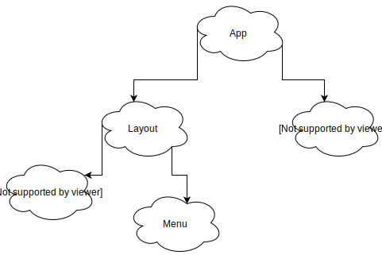

class: center, middle

# Hooks and Context, the way to a new architecture

Kevin & Kawamura

---

class: middle

## What we will cover during this presentation

- The Context API
- The new Hooks API
- Some clues for more modern and more flexible architecture
- The edge cases

---

class: center, middle

## The Context API

---

class: middle

### A word on render props

- You can pass anything as props to a Component...
- ...including a function! This is a render prop
- A render prop can be a `children` as well!

```tsx
<DataProvider render={data => <h1>Hello {data.target}</h1>} />
```

https://reactjs.org/docs/render-props.html

<!-- It's an actual react pattern, And lot's of famous react libraries like React Router, Downshift uses it. -->

---

### Why?

Let's say we have a super smart component, the **parent**, that fetches the current connected user from an API.

And a toolbar, the **child**, that accepts this user as a prop, to display the data properly.

How can we update the child component accordingly?

```tsx
<FetchCurrentUser>
  <Toolbar /> // <- How can we pass the fetched user to this component?
</FetchCurrentUser>
```

---

### How?

.center[]

<!-- We will not go deep into cloning elements but render props might be good suite in this ssituation -->

---

### Example

```tsx
// Types and imports
const FetchCurrentUser = ({ children }: FetchCurrentUserProps) => {
  // Fetch the current user

  return <>{children({ currentUser })}</>;
};

const Toolbar = ({ currentUser }: ToolbarProps) => {
  return ; // UI
};

// then...
<FetchCurrentUser>
  {props => <Toolbar {...props} />}
</FetchCurrentUser>

// or
// Notice that here the Toolbar component is not created with React.createElement
// and will not be considered a Component by React it's critical to understand
// this before we discuss about the Hooks
<FetchCurrentUser>
  {Toolbar}
</FetchCurrentUser>
```

---

### How is it related to the Context API?

Everything is fine, we can pass the current use _down_ to the children, but what if we wanted to use the currentUser in two different components? Like Toolbar _and_ a Profile component?

And what if, they were mounted in two different branch of our application tree, like in the following:



---

### Simple solution

We need to find the first common ancestor, here `app`, and perform the logic here.

Then we can pass down the props to every children, and sub-children...

Meaning:

- Many components will receive props they are not concerned of at all
- It can get super messy, and really tedious
- Refactoring this kind of application, without a type language like Flow, TypeScript, or ReasonML, **will** be a nightmare

---

### Context to the rescue!

- The Context itself is _not new_, it has always existed...
- ...hidden behind an undocumented API
- The proper API is new (> React 16), it took some time to design it
- Libraries like Redux or Redux-Form actually use the Context (think about the `Provider` component exposed by Redux), but still use the old, undocumented API

_If Redux uses it, it means we **can** everything we used to solve with it, with the Context API_

Some limitations:

- No proper Debug system
- You can connect a context to the Redux Devtool, but you have to do so manually

---

### createContext

In order to create a context, we can use the `createContext` function exposed by React:

```tsx
const { Consumer, Provider } = createContext(defaultValue);
```

And that's it!

The `createContext` takes a _defaultValue_ (which is not an _initialValue_, more on this later), and returns an object containing a `Consumer` and a `Provider`.

---

### Provider/Consumer - Example

```tsx
const { Consumer, Provider } = createContext("hello"); // <- Not the initial value

const DeeplyNestedComponent = () => (
  <Consumer>{value => <div>{value}</div>}</Consumer>
);

const NestedComponent = () => <DeeplyNestedComponent />; // <- No props!
// Will generate <div>hello</div>
const _ = (
  <Provider value="hello">
    <NestedComponent /> // <- No props!
  </Provider>
);
```

---

### Additional word

`defaultValue` is _not_ `initialValue`, it's the value that will be passed to the Consumer, if it's not wrapped in a Provider.

```tsx
const { Consumer, Provider } = createContext("hello");

// This will generate `<div>hello</div>`
const _ = <Consumer>{value => <div>{value}</div>}</Consumer>;
```

It's not something you should care too much about, since you should nest your Consumers in Providers.

---

class: center, middle

## The Hooks API

---

class: middle

> Hooks are a new feature proposal that lets you use state and other React features without writing a class. They’re currently in **React v16.7.0-alpha**

---

### What does Hook solve?

React Component is great to organize large UI into small, independent, and reusuable pieces.

However, it is quite challenging to break down complex components, since the logic is **stateful** and can't be extracted to a function or other component.

---

### Complex components, with logic all over the lifecyle

```tsx
class App extends React.Component {
  constructor(props) {
    super(props);
    this.state = { name: "Kawamura", like: "curry" };
  }
  componentDidMount() {
    fetchA();
    fetchB();
    subscribe();
  }
  componentWillUpdate(props) {
    if (props.a !== this.props.a) fetchA();
    if (props.b !== this.props.b) fetchB();
  }
  componentWillUnmount() { unSubscribe(); }
  handleNameChange(event) { this.setState({ name: event.target.value }); }
  render() { ... }
}
```

The business logic, in all _lifecycle methods_ are _internally_ **inconsistent**, `componentDidMount` for instance will fetch `A` and `B` here.

Also, if we wanted to extract the methods, the logic would be **split apart**.

Basically, instead of splitting the code for **technical reasons**, we want to split **by concern**. 😇

---

### Some Solutions.

- Context
- Render props
- Higher Order Components

These patterns require you to restructure your components.  
Which can be **tedious**, make the code harder to follow, and also creates **false hierarchy**.

```tsx
<ProviderA>
  <ProviderB>
    <SomeRenderProps>{({ data }) => <div>{data}</div>}</SomeRenderProps>
  </ProviderB>
  <RenderProps>{({ data }) => <div>{data}</div>}</SomeRenderProps>
</ProviderA>
```

Wouldn't it be easier to have **one** common way to share logic between components?  
... functions?

Functions _can't have local state_.

---

### Reusing stateful logic between Components.

**Hooks** are a greak solution for solving these problems.

Hooks let us use React features, like the `statefullness`, `lifecycle`, etc.. from a function.

We can extract and share the logic inside a component into reusable independent functions without changing your component hierarchy.

---

### Example - Without Hooks

```tsx
class App extends React.Component {
  constructor(props) {
    super(props);
    this.state = { name: "Kawamura", favoriteFood: "curry" };
    this.handleNameChange = this.handleNameChange.bind(this);
    this.handleFavoriteFoodChange = this.handleFavoriteFoodChange.bind(this);
  }
  handleNameChange(event) {
    this.setState({ name: event.target.value });
  }
  handleFavoriteFoodChange(event) {
    this.setState({ favoriteFood: event.target.value });
  }
  render() {
    const { name, favoriteFood } = this.state;
    return (
      <>
        <input value={name} onChange={handleNameChange} />
        <input value={favoriteFood} onChange={handleFavoriteFood} />
      </>
    );
  }
}
```

---

### Example - With Hooks - useState

```tsx
import React, { useState } from "react";

const App = () => {
  const [name, setName] = useState("Kawamura");
  const [favoriteFood, setFavFoodName] = useState("curry");

  const handleNameChange = e => {
    setName(e.target.value);
  };

  const handleFavFoodNameChange = e => {
    setFavFoodName(e.target.value);
  };
  return (
    <>
      <input value={name} onChange={handleNameChange} />
      <input value={favoriteFood} onChange={handleFavFoodNameChange} />
    </>
  );
};
```

---

### Hooks - State

**useState**

```tsx
import { useState } from "react";

function Example() {
  // Declare a new state variable, which we'll call "count"
  const [count, setCount] = useState(0);

  return (
    <div>
      <p>You clicked {count} times</p>
      <button onClick={() => setCount(count + 1)}>Click me</button>
    </div>
  );
}
```

- Called inside a function component to add _local state_.
- React will preserve this state between re-renders.
- `useState` returns a pair: the current state value and a function that lets you update the state.

The first argument is the _initial state_.  
Unlike `this.state`, the state here doesn’t have to be an object.

<!-- So now we can manipulate the react local state from a functional component  -->

---

### Example - Without Hook - Context

<!-- What if we want to read some Context?, Let's see what it will be like in the class Component. -->
<!-- It's often used for to read the Theme or current Locale and so on , and this is how we consumer context-->
<!-- I will be importing ThemeContext, and LocaleContext. and behind the Provider is been wrapped with the context -->

- Uses the `Consumer` from the context, and consumes the data.
- Uses render props.

```tsx
import { ThemeContext, LocaleContext } from "./myContexts";

class App extends React.Component {
  render() {
    return (
      <ThemeContext.Consumer>
        {theme => (
          <LocaleContext.Consumer>
            {locale => <div className={theme}>{locale}</div>}
          </LocaleContext.Consumer>
        )}
      </ThemeContext.Consumer>
    );
  }
}
```

<!-- False hierarchy, complex render props.-->

---

### Example - With Hook - Context

<!-- So, how can we do this with hooks?, We will "use Context", from react. And reads the context in the render-->
<!-- It just not read the context, but also subscribes to the context, which means that the component will re-render when the context has changed. -->

**useContext**

Not just consume the data, but it also subscribe to the context.

```tsx
import React, { useContext } from "react";
import { ThemeContext, LocaleContext } from "./myContexts";

const App = () => {
  const theme = useContext(ThemeContext);
  const locale = useContext(LocaleContext);

  return <div className={theme}>{locale}</div>;
};
```

---

### Example - Without Hook - Effects

<!-- Next, what if we want to use some lifecycle methods., Let's see what it will be like in the class Component. -->
<!-- You’ve likely performed data fetching, subscriptions, or manually changing the DOM from React components before. We call these operations “side effects” (or “effects” for short) because they can affect other components and can’t be done during rendering. -->

What happens if you want to use the lifecyle method from the React.Component class?

- Data fetching, subscriptions, or manually changing the DOM from React components.

```tsx
class App extends React.Component {
  componentDidMount() {
    API.subscribeToMessage(this.props.id);
  }
  componentWillUpdate() {
    API.subscribeToMessage(this.props.id);
  }
  componentWillMount() {
    API.unsubscribeToMessage(this.props.id);
  }
  render() {
    return; // UI
  }
}
```

---

### Example - With Hook - Effect

**useEffect**

```tsx
import React, { useEffect } from "react";

const App = props => {
  useEffect(
    () => {
      API.subscribeToMessage(props.id);

      return () => {
        API.unSubscribeToMessage(props.id);
      };
    },
    [props.id] // Only re-subscribe if props.id changes
  );

  return; // UI
};
```

- First argument is a `function` that will be triggered after performing the DOM updates. (componentDidMount, componentWillUpdate)
- You can tell React to skip applying an effect if certain values haven’t changed between re-renders. To do so, pass an array of "inputs" as an optional second argument to `useEffect`:

<!-- By default the effect will be triggered in every render, but you can optmize it by giving it an array as an optional second arguement.  -->

---

### Hooks - Reducer

**useReducer**

Alternative to to `useState`.

```tsx
const [state, dispatch] = useReducer(reducer, initialState);
```

- Accepts a reducer of type `(state, action) => newState`.
- Returns the current `state` paired with a `dispatch` method.

---

### Example - Reducer

```tsx
const initialState = { count: 0 };

function reducer(state, action) {
  switch (action.type) {
    case "increment":
      return { count: state.count + 1 };
    case "decrement":
      return { count: state.count - 1 };
    default:
      return state;
  }
}

function Counter({ initialCount }) {
  const [state, dispatch] = useReducer(reducer, { count: initialCount });
  return (
    <>
      Count: {state.count}
      <button onClick={() => dispatch({ type: "increment" })}>+</button>
      <button onClick={() => dispatch({ type: "decrement" })}>-</button>
    </>
  );
}
```

---

### Hooks - Rules!

#### Only Call Hooks at the Top Level

Don’t call Hooks inside loops, conditions, or nested functions. Instead, always use Hooks at the top level of your React function.

#### Only Call Hooks from React Functions

Don’t call Hooks from regular JavaScript functions.

There are some eslint plugins, for linting.  
_https://www.npmjs.com/package/eslint-plugin-react-hooks_

---

class: center, middle

### For more information


_https://youtu.be/dpw9EHDh2bM_

---

class: center, middle

## A new Architecture

---

class: middle

### Some rules

- Try to split as much as possible the logic and the view by using `hooks`
- Doing so is not _mandatory_ but it will make our code easier to reuse
- It may become necessary to "wrap" a `hook` with a `ContextfulComponent`

---

### Example (without hooks)

Let's say we want to fetch some posts from a server with this API: https://jsonplaceholder.typicode.com/posts.

Using the Context API, we can naively implement this kind of solution:

#### Types

```tsx
import React, { Reducer, useEffect, useReducer } from "react";

// Define some types related to the posts

interface State {
  isFetchingPosts: boolean;
  posts: Post[] | null;
}

type Actions =
  | { type: "FETCH_POSTS_INIT" }
  | { type: "FETCH_POSTS_FAILURE"; payload: Error }
  | { type: "FETCH_POSTS_SUCCESS"; payload: Post[] };
```

---

#### Logic - reducer

```tsx
const reducer: Reducer<State, Actions> = (state, action) => {
  switch (action.type) {
    case "FETCH_POSTS_INIT": {
      return { ...state, isFetchingPosts: true };
    }

    case "FETCH_POSTS_FAILURE": {
      return { ...state, isFetchingPosts: false };
    }

    case "FETCH_POSTS_SUCCESS": {
      return { ...state, isFetchingPosts: false, posts: action.payload };
    }
  }
};
```

---

#### Logic - Component

```tsx
const Component = (/* some props */) => {
  const [state, dispatch] = useReducer(reducer, { isFetchingPosts: false, posts: [] });

  const fetchPosts = async () => {
    dispatch({ type: 'FETCH_POSTS_INIT' });
    // Actually fetch data, building a `response` value
    if (!response.ok) {
      return dispatch({ type: 'FETCH_POSTS_FAILURE', payload: new Error('...') });
    }

    return dispatch({ type: 'FETCH_POSTS_SUCCESS', payload: await response.json() });
  };

  useEffect(() => {
    fetchPosts();
  }, []);

  return (
    // UI
  );
};
```

---

class: center, middle

## What if I want to fetch an other resource?

---

class: center, middle

### I will need to copy paste most of the logic...

---

class: center, middle

### Let's try to split the View and the Hook

---

### Example (with hook)

We will now try to implement the same logic using Hooks

In `/src/hooks/useFetch.ts`:

#### Types (everything is now dynamic)

```tsx
import { Reducer, useEffect, useReducer } from "react";

interface State<T> {
  data: T | null;
  isFetching: boolean;
}

type Actions<T> =
  | { type: "FETCH_INIT" }
  | { type: "FETCH_FAILURE"; payload: Error }
  | { type: "FETCH_SUCCESS"; payload: T };
```

---

#### Logic - reducer

```tsx
const reducer: Reducer<State<any>, Actions<any>> = (state, action) => {
  switch (action.type) {
    case "FETCH_INIT": {
      return { ...state, isFetching: true };
    }

    case "FETCH_FAILURE": {
      return { ...state, isFetching: false };
    }

    case "FETCH_SUCCESS": {
      return { ...state, isFetching: false, data: action.payload };
    }
  }
};
```

---

### Logic - Hook body

```tsx
// The return type has to be explicitly a Tuple
export type UseFetchReturnType<T> = [State<T>, Dispatch<Actions<T>>];

export function useFetch<T>(url: string): UseFetchReturnType<T> {
  const [state, dispatch] = useReducer<State<T>, Actions<T>>(reducer, {
    isFetching: false,
    data: null
  });

  const fetchData = async () => {
    dispatch({ type: "FETCH_INIT" });
    // Fetch data...
    if (!response.ok) {
      return dispatch({ type: "FETCH_FAILURE", payload: new Error("...") });
    }
    return dispatch({ type: "FETCH_SUCCESS", payload: await response.json() });
  };

  useEffect(() => {
    fetchData();
  }, []);

  // We can also only return the state, to avoid the user to accidentaly change the state
  return [state, dispatch];
}
```

---

#### Logic - Component

In `src/components/Posts.tsx`:

```tsx
// Some types related to Post

const Component = (/* some props */) => {
  const [state, dispatch] = useFetch<Post[]>(
    "https://jsonplaceholder.typicode.com/posts"
  );

  return; // UI
};
```

In `src/components/Users.tsx`:

```tsx
// Some types related to User

const Component = (/* some props */) => {
  const [state, dispatch] = useFetch<User[]>(
    "https://jsonplaceholder.typicode.com/users"
  );

  return; // UI
};
```

---

class: middle

### What about the components?

Two kinds of components:

- **ContextfulComponent**: those using `Context`, they are equivalent to the `StatefulComponent` we have without Redux, or the `ConnectedComponent` with Redux.
- **SimpleComponent**: the simple "dumb" Components. They will just use `ContextfulComponents` and other "dumb" components.

---

class: middle

### ContextfulComponents

- Will more likely use one or several Hooks
- Expose the `Context`, a (possibly) customized `Provider` and a (possibly) customized `Consumer`
- May be "Abstract". If they are, they will just wrap some hook(s) to ease their use

---

### Hooks limitation

In our previous example, we needed to fetch some posts, and some users dynamically. We had a `/posts` route and a `/users` route.

Now, what if we needed some data when initializing the application? Like the connected user data for instance?

If we use the `useFetch` hook as is at the top level it may become tedious to share the user data with the children, like this:

```tsx
// Toplevel component
const App = (/* some props */) => {
  // `state.data` will be null then the current user
  const [state, dispatch] = useFetch("https://www.myapi/current-user");
  // ...

  return (
    // ...
    <Layout
      user={state.data} /* <- We need to pass down the user object here */
    />
    // ...
  );
};
```

---

class: center, middle

### A solution: The "Abstract Contextful Component"

In order to solve this kind of problems, as we already said, we need a context.

Then we can use, or the context's consumer, or the `useContext` hook.

---

### Here comes the Abstract Contextful Component:

```tsx
import React, { createContext } from "react";

import { useFetch } from "../hooks/useFetch";

// Some types related to User

// We know the Value passed to the Context will be exactly the value returned by the Hook
type Value = UseFetchReturnType<User>;

// We export the Context so it can be used with `useContext`
export const Context = createContext<Value>(null as any);

// The props are similar to the hook arguments
interface Props {
  children?: React.ReactNode;
  url: string;
}

// The consumer does not need any customization here
export const Consumer = Context.Consumer;

export const Provider = ({ children, url }: Props) => {
  const value: Value = useFetch(url);

  return <Context.Provider value={value}>{children}</Context.Provider>;
};
```

---

### Example - Abstract Contextful Component - App

```tsx
// Toplevel component
const App = (/* some props */) => {
  // ...
  return (
    // ...
    <Fetch.Provider url="https://www.myapi/current-user">
      <Layout
      /* No need to pass props anymore */
      />
    </Fetch.Provider>
  );
};
```

---

### Example - Abstract Contextful Component - Use with Consumer

```tsx
const DeeplyNestedComponent = (/* some props */) => {
  // `state.data` being null or the current user here
  return <Fetch.Consumer>{([state]) => state.data}</Fetch.Consumer>;
};
```

---

### Example - Abstract Contextful Component - Use with useContext

```tsx
const DeeplyNestedComponent = (/* some props */) => {
  const [state] = useContext(Fetch.Context);

  // `state.data` being null or the current user here
  return <>{state.data}</>;
};
```

---

class: middle

### SimpleComponents

- May use some hooks (`useContext` for instance)
- No context, no state
- As small as possible (if when writing a rather big component you need at some point to `useContext` or some `Consumer`, you better create a new component)
- Modular, UI oriented

---

class: middle

### Folders organization (example)

```
  /src
    /hooks
    /contextfulComponents
    /simpleComponents
```

---

class: center, middle

## Edge cases

---

class: center, middle

### Can I map over provider/consumer couples?

---

#### Example - A simple ContextfulComponent

```tsx
// Imports and types

export const Context = createContext<Value>(null as any);

export const Provider = ({ children, name }: ProviderProps) => {
  const [currentName, setCurrentName] = useState(name);

  return (
    <Context.Provider
      value={{ currentName, message: `Hello ${currentName}`, setCurrentName }}
    >
      {children}
    </Context.Provider>
  );
};

export const Consumer = Context.Consumer;
```

---

#### Example - Let's map over it!

```tsx
[1, 2, 3].map((_, index) => (
  <Message.Provider name="mapping" key={index}>
    <Message.Consumer>
      {({ currentName, message, setCurrentName }) => (
        <div>
          // We display the message here for the moment
          {message}
          <div>
            <input
              // Boilerplate code to actually set the name
              onChange={({ currentTarget: { value } }) => setCurrentName(value)}
              value={currentName}
            />
          </div>
        </div>
      )}
    </Message.Consumer>
  </Message.Provider>
));
```

---

class: center, middle

### It looks good, but now, what if I want to display the message in a _different place_?

---

class: middle

### Two solutions

- We can "merge" the state into one, and make the Provider handle several values

#### or

- We can use an "index" in a dedicated state, inside the parent Component

_Notice that this does not make the parent Component a `ContextfulComponent`. The parent can remain a `SimpleComponent`._

---

#### Example - The Parent - Inputs

```tsx
// We can declare our umbrella state and initialize it
const [names, setNames] = useState(Array(3).fill("troubles"));

return (
  //...
  // Notice how we map over the `names` here
  {names.map((name, index) => (
    // The rest is similar...
    <Message.Provider name={name} key={index}>
      <Message.Consumer>
        {({ currentName, setCurrentName }) => (
          <input
            onChange={({ currentTarget: { value } }) => {
              // ...except here, we may need to sync the values and update both the states
              setCurrentName(value);
              setNames([
                ...names.slice(0, index),
                value,
                ...names.slice(index + 1, names.length)
              ]);
            }}
            value={currentName}
          />
        )}
      </Message.Consumer>
    </Message.Provider>
  ))}
  //...
);
```

---

#### Example - The Parent - Messages

```tsx
//...
{
  names.map((name, index) => (
    <Message.Provider name={name} key={index}>
      <SmartConsumer name={name} /> // <- We use a Component here
    </Message.Provider>
  ));
}
//...
```

---

#### Example - The SmartConsumer Component

```tsx
const SmartConsumer = ({ name }: ConsumerProps) => {
  const { message, setCurrentName } = useContext(Message.Context);

  useEffect(
    () => {
      setCurrentName(name);
    },
    [name]
  );

  return <div>{message}</div>;
};
```

---

class: center, middle

### It's basically what we would do to solve the same issue using `StatefulComponent`

_Elm or frameworks implementing the The Elm Architecture would use the same kind of structure as well_

_Notice that for this example, we could have dropped most of the sync logic (and probably some Provider/Consumer as well)_

---

class: center, middle

### An other edge case: Fetching the exact set of data, use it in several places

---

### Problem

Let's say we have a backoffice application where we can create different kind of users, using different forms.

For all the user kinds, we'll need to provide the country they were born in.

The list is not hard coded, it's fetched from a server! But we don't want to fetch it several times...

If we have a `useCountries` hook, and `Countries` ContextfulComponent, everytime we will use the `Provider`, a request will be performed. It's impossible to cache the data at the hook level, or at the Context level...

How could we solve this?

---

class: middle

### Solution(s)

- Quick win: we put the provider at the top level of our application.

It works, and it fits most of the use cases.

But what if we didn't want to fetch the data everytime?

What if we wanted to fetch the coutries when needed, and then cache them??

- We need to cache at the request level. With a wrapper around `fetch` (or using the cache system provided by some GraphQl clients like Apollo)

---

### The "bottleneck" schema


---

class: middle

## Cons so far...

- Still experimental (available with React 16.7-alpha\* only)
- May lead to some code smell, like the Providers pyramid of doom, or the Provider/Context couples

---

### The Providers pyramid of doom

```tsx
const App = () => {
  //...
  return (
    <FetchSomethingProvider>
      <SuperUsefulProvider>
        <DoACriticallyImportantThingProvider>
          <WhateverProvider>
          //...
            <AppEntryPoint /> // <- Finally!
          // ...
          </WhateverProvider>
        </DoACriticallyImportantThingProvider>
      </SuperUsefulProvider>
    </FetchSomethingProvider>
  );
}
```

---

### Avoiding it using a coroutine - The coroutine

```tsx
const coroutine = <Props>(
  generator: (props: Props) => IterableIterator<JSX.Element>
): React.ComponentType<Props> => (props: Props) => {
  const iterator = generator(props);

  const rec = (Component: JSX.Element, done: boolean): JSX.Element => {
    if (!done) {
      const { done, value } = iterator.next();

      return React.cloneElement(Component, { children: rec(value, done) });
    }

    return Component;
  };

  const { done, value } = iterator.next();

  return rec(value, done);
};
```

---

### Avoiding it using a coroutine - Using the coroutine

```tsx
// We wrap a component in the coroutine...
const App = coroutine(() => {
  //...
  //...so we can `yield` the needed providers
  yield <FetchSomethingProvider />;
  yield <SuperUsefulProvider />;
  yield <DoACriticallyImportantThingProvider />;
  yield <WhateverProvider />;

  return (
    <AppEntryPoint />
  );
});
```

---

## Pyramid of doom with the Consumers

```tsx
//...
<Provider1>
  <Consumer1>
    //...
    <Provider2>
      <Consumer2 />
    </Provider2>
    //...
  </Consumer1>
</Provider1>
```

---

class: middle

## Pyramid of doom with the Consumers: How to solve it

- Everytime you need a Consumer, you should consider creating a separated Component!
- So that you can use the `useContext` hook

---

class: middle

### Let's summarize, some rules

- When you have complex, shared logic, create a custom hook, it's better to have hooks used once, than to duplicate complex code in several components
- If you need this logic to be shared between Parents/Deeply nested children, wrap it in a ContextfulComponent
- A `SimpleComponent` should become a `ContextfulComponent` _if and only if_ it contains a state that has to be shared
- When you need to map over Provider/Consumer couples, and need the logic in several places of your page, merge the states, or "index" them

---

class: center, middle

# Enjoy the Hooks!!
